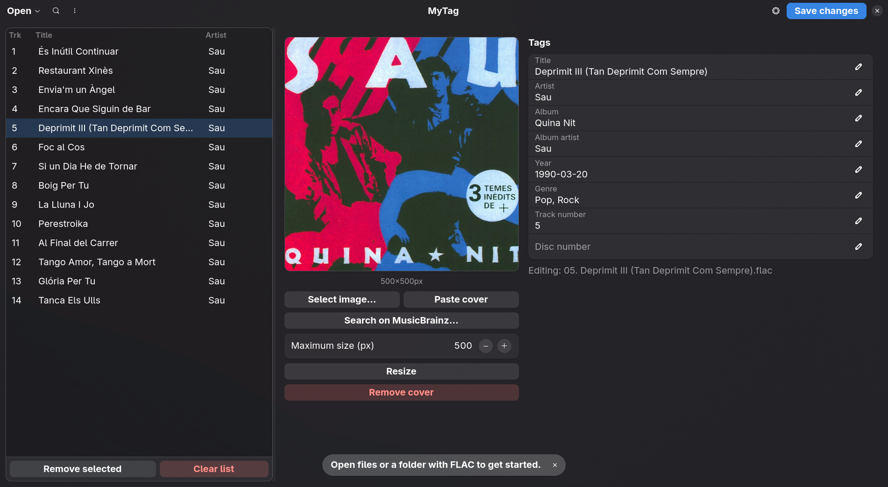
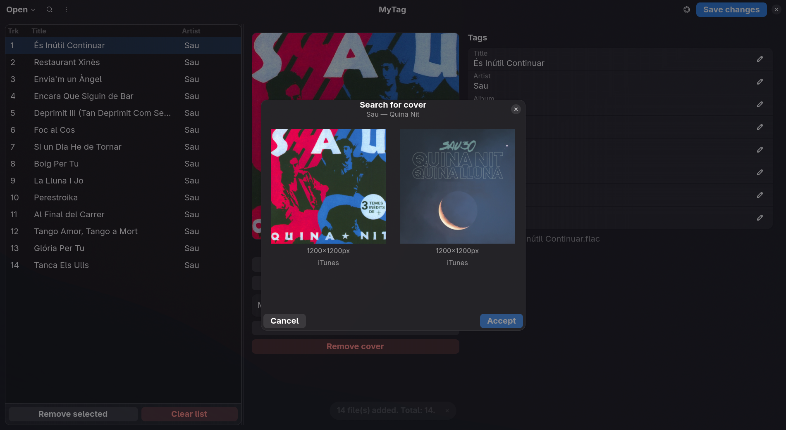

# MyTag

**A clean, focused tag and cover art editor for your FLAC music files, built for the Linux desktop.**

MyTag lets you load a single file — or a whole folder of albums at once — and edit tags and cover art across as many tracks as you like, without ever touching anything you didn't ask it to.



## Why MyTag

Most tag editors on Linux are either ancient, Windows tools running under Wine, or full-blown music library managers you don't need. MyTag does one thing: it edits FLAC tags and cover art, cleanly, natively, and in your language.

- **Bulk-edit with confidence.** Select several tracks and MyTag clearly marks any field where they disagree (`‹multiple values›`), so you never overwrite a title while meaning to fix an album name.
- **Cover art, sorted.** Pick an image from disk, paste one from the clipboard, or search MusicBrainz and iTunes right from the app and pick from the results. Resize to whatever size you need, proportions preserved.



- **Nothing happens until you say so.** Every edit lives in memory until you hit *Save changes* — browse, tweak, and undo your mind freely.
- **Speaks your language.** Full interface in **English, Spanish, and Catalan**, auto-detected from your system locale on first run.
- **Fits right in.** Built with GTK4 and Libadwaita, it looks and feels like a native part of your desktop — light or dark, whatever your theme is.

## Features

- Edit Title, Artist, Album, Album Artist, Year, Genre, Track Number and Disc Number, for one file or hundreds at once.
- Load a folder recursively — drop a whole artist directory on the window and every FLAC underneath gets picked up.
- Search and filter a long list of loaded tracks.
- Auto-number a set of tracks (1, 2, 3…) in one click.
- Revert unsaved changes back to what's actually on disk.
- Clear the whole list, or just the tracks you've selected.
- Adjustable interface scale, from the Preferences window.

## Installation

MyTag is currently in **alpha** — it works, but expect rough edges. Grab the latest build from the [Releases page](https://github.com/maestebanc/MyTag/releases).

### Flatpak (any distro)

```bash
flatpak install mytag-*.flatpak
```

### Debian / Ubuntu (24.04+, or Debian trixie and newer)

```bash
sudo apt install ./mytag_*_all.deb
```

### Fedora (or another RPM distro on Python 3.13)

```bash
sudo dnf install ./mytag-*.noarch.rpm
```

### Arch Linux

No package published yet — building from source (below) works fine in the meantime.

## Running from source

MyTag needs GTK4 and Libadwaita, which are best installed as system packages rather than through pip:

```bash
# Arch
sudo pacman -S --needed gtk4 libadwaita python-gobject

# Debian/Ubuntu
sudo apt install python3-gi gir1.2-gtk-4.0 gir1.2-adw-1

# Fedora
sudo dnf install python3-gobject gtk4 libadwaita
```

Then, from a clone of this repository:

```bash
python3 -m venv --system-site-packages .venv
./.venv/bin/pip install mutagen Pillow
./.venv/bin/python -m mytag
```

## License

MyTag is released under the [MIT License](LICENSE).
